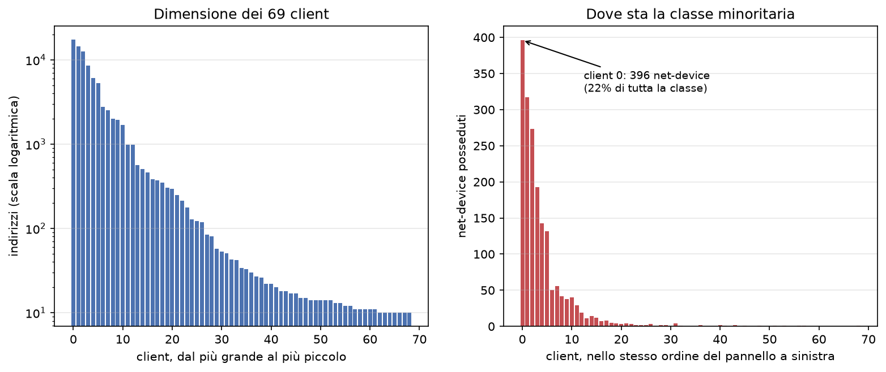
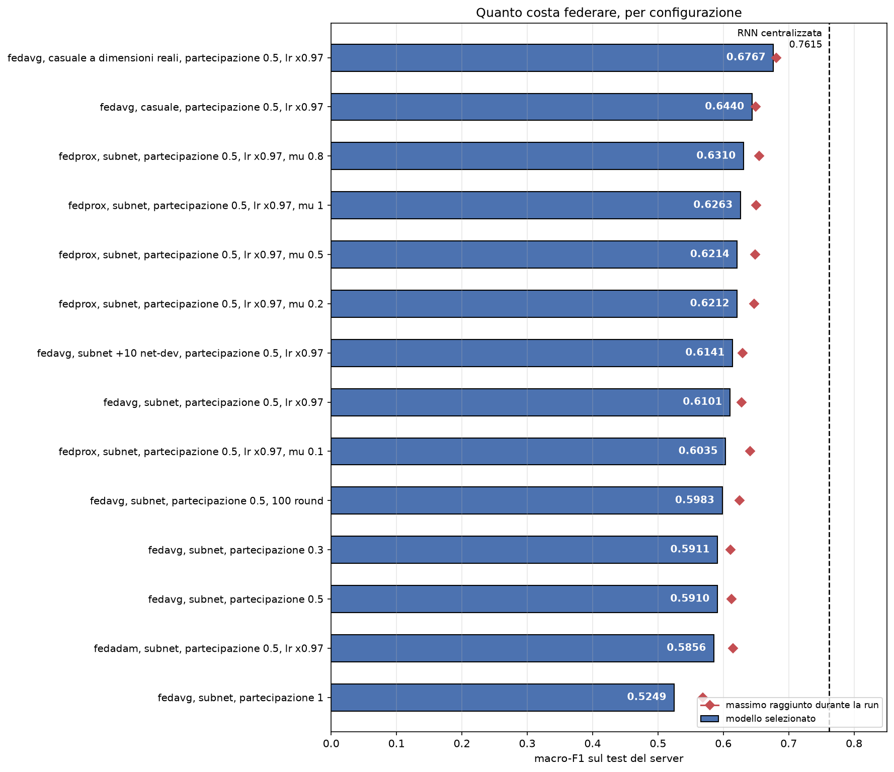
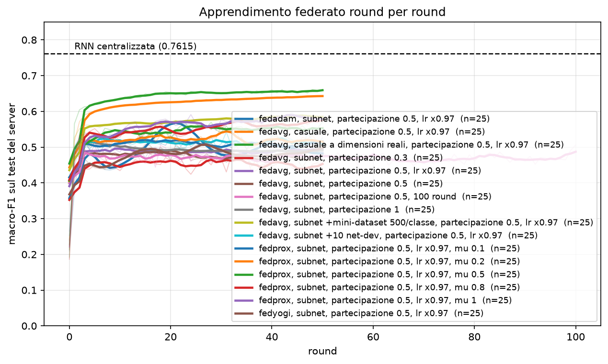
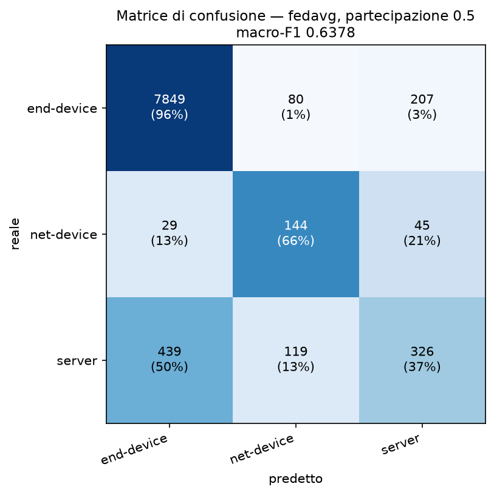
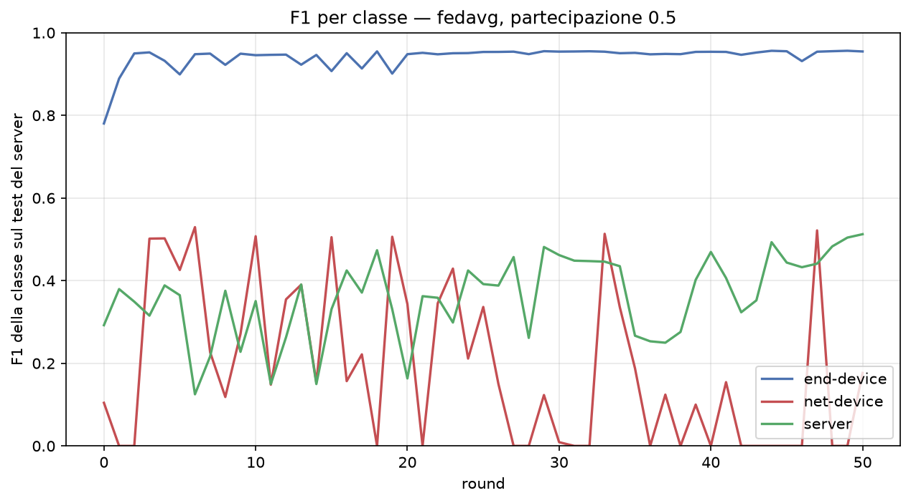

# RISULTATI DEGLI ESPERIMENTI 

Sono state effettuate 15 esecuzioni complete su WSL2 (16 core, 7,4 GB di RAM, RTX 5060 con 8 GB). 
I comandi che le hanno prodotte stanno in [`tools/esperimenti.sh`](tools/esperimenti.sh) mentre gli storici round per round in `outputs/history_*.json`, e le figure si rigenerano con `python tools/grafici.py`.

Ogni configurazione è stata eseguita **due volte** più FedAdam con server-learning-rate=0.1 che è stata eseguita una volta.

## Cosa viene confrontato con cosa

Il riferimento è la RNN centralizzata di base fornita, che ottiene **macro-F1 0,7615** sul test set. 

Il confronto viene effettuato sullo stesso test set poichè lo split avviene con lo stesso seed (111) e le stesse proporzioni, ottenendo gli stessi conteggi per classe (8136 end-device, 218 net-device e 884 server).

Il modello inviato al server viene selezionato in base alla macro-f1 score migliore della run sui dati del client. Si utilizza come metrica la macro-f1 score rispetto all'accuratezza poichè bisogna tenere conto dello sbilanciamento delle classi nel dataset.

## La federazione

Un client per subnet istituzionale, con la soglia di dieci indirizzi etichettati
sotto la quale una subnet non diventa client.

| | |
|---|---|
| client | 69 |
| indirizzi distribuiti | 82.527 |
| indirizzi al server (test) | 9.238 |
| per client: min / mediana / max | 10 / 34 / 17.398 |
| pesi di classe aggregati | 0,3761 / 15,0014 / 3,6447 |

## Tutti gli esperimenti
I risultati degli esperimenti sono stati raggruppati in una tabella che indica (in ordine):
* **strategia**: strategia utilizzata
* **ft**: frazione di client che partecipa a ogni round 
* **lrd**: fattore di decadimento del learning rate
* **round**: numero di round effettuati nell'addestramento
* **selezionato**: macro-f1 sul test del modello consegnato, media delle due esecuzioni
* **scarto**: quanto quel risultato è affidabile (calcolato come distanza tra le due esecuzioni)
* **coda**: quanto vale un modello tipico verso la fine dell'addestramento
* **dev.std**: deviazione standard della macro-f1 sui 31 round
* **net-dev a zero**: in quanti degli ultimi 31 round il modello aveva smesso del tutto di riconoscere i net-device

**Coda** e **dev. std** descrivono gli ultimi 31 round e dicono quanto è buono e quanto è stabile l'addestramento. Vengono considerati gli ultimi 31 round (nelle esecuzioni da 50 round) perché nei primi venti il modello sta ancora imparando da zero.

In tutti gli esperimenti si hanno 2 epoche locali, Adam a 6,92e-4, weight decay 0,01, batch 64.

| strategia | ft | lrd | round | selezionato | scarto | coda | dev. std | net-dev a zero |
|---|---|---|---|---|---|---|---|---|
| fedavg | 0.5 | — | 50 | **0,6286** | 0,018 | 0,4904 | 0,057 | 14/31 |
| fedavg | 0.5 | 0.97 | 50 | 0,6221 | 0,011 | 0,4964 | 0,053 | 12/31 |
| fedadam | 0.5 | 0.97 | 50 | 0,5915 | 0,072 | 0,4997 | 0,054 | 8/31 |
| fedavg | 0.5 | — | 100 | 0,5905 | 0,045 | 0,4523 | 0,044 | 14/31 |
| fedprox | 0.5 | 0.97 | 50 | 0,5534 | 0,116 | **0,5144** | 0,053 | 12/31 |
| fedavg | 1.0 | — | 50 | 0,5510 | 0,096 | 0,4890 | **0,017** | **2/31** |
| fedavg | 0.3 | — | 50 | 0,5224 | 0,002 | 0,4396 | 0,065 | 16/31 |
| *centralizzata* | | | | *0,7615* | | | | |

## La partecipazione: 0.3 contro 0.5

| | esecuzione 1 | esecuzione 2 | media |
|---|---|---|---|
| `fraction-train` 0.3 | 0,5217 | 0,5232 | **0,5224** |
| `fraction-train` 0.5 | 0,6378 | 0,6194 | **0,6286** |

Il guadagno è di **0,106**.

Con 34 client su 69 (fraction-train=0.5) la composizione somiglia molto di più a quella globale, e gli aggiornamenti puntano tutti più o meno nella stessa direzione, mentre con 20 il round dipende da quali client escono (vedi colonna coda: 0,4396 contro 0,4904).

## Perché la partecipazione totale non migliora ancora
Con fraction-train=1, la simulazione performa peggio di quanto faccia con fraction-train=0.3, nonostante l'addestramento fosse il più stabile di tutti gli esperimenti. 
La maggiore stabilità non aiuta a trovare il modello migliore poichè un addestramento che salta produce round a 0,64 fra cui scegliere, mentre uno stabile arriva a 0,49 e non offre niente di meglio.

## Le strategie alternative

| configurazione | run 1 | run 2 | media | scarto |
|---|---|---|---|---|
| fedavg | 0,6378 | 0,6194 | 0,6286 | 0,018 |
| fedavg + decadimento | 0,6166 | 0,6276 | 0,6221 | 0,011 |
| fedadam | 0,6277 | 0,5553 | 0,5915 | 0,072 |
| fedprox | 0,6115 | 0,4953 | 0,5534 | 0,116 |

Le configurazioni con l'addestramento più stabile (FedProx, FedAdam e partecipazione totale) sono quelle che consegnano il modello **meno prevedibile**, mentre FedAvg e decadimento danno risultati riproducibili e prevedibili.

Raddoppiare i round non aiuta (0,5905 con 100R e 0,6286 con 50R) e dopo il 50esimo round si inizia a peggiorare.

Il progetto usa `server-learning-rate = 0.01` invece del default di Flower pari a 0,1. Per controllare se la scelta contasse è stata fatta una run di FedAdam con il defaulte e i risultati sono equivalenti: 0,5947 contro una media di 0,5915 con 0,01.

## Dove si perde il divario, classe per classe

| classe | centralizzato | federato | perdita | quota del divario |
|---|---|---|---|---|
| end-device | 0,9642 | 0,9540 | 0,0102 | 3% |
| net-device | 0,6304 | 0,5053 | 0,1251 | 31% |
| **server** | 0,6900 | **0,4266** | **0,2634** | **66%** |

La colonna *federato* è la media delle due esecuzioni. La matrice di confusione più sotto invece viene da una sola run, la migliore delle due, quindi ricavando la F1 da lì sui net-device esce 0,5134 e non 0,5053.

**Due terzi del divario vengono dalla classe `server`** che resta bassa per tutta la durata dell'addestramento.
Tuttavia, questo non è un problema di distribuzione poichè i server sono la classe meglio distribuita delle 3 (al contrario dei net-device che sono concentrati in pochi client che spesso non vengono campionati):

| classe | client che ne possiedono | quota del client più ricco |
|---|---|---|
| end-device | 48 su 69 | 24% |
| net-device | 42 su 69 | **56%** |
| server | **61 su 69** | **15%** |

Un'ipotesi (non verificata) è che i server, soprattutto quelli di piccole dimensioni,  vengano considerati simili agli end-device poichè generano del traffico paragonabile a quello di una postazione di lavoro attiva e perchè il client più grande della federazione (21% del totale) è composto prevalentemente da end-device (99,8%) e questi contribuiscono molto al peso della FedAvg.

## Che cosa sbaglia il modello

Si noti come su 884 server veri, 439 vengono classificati come end-device, 326 sono corretti e 119 vanno come net-device.

La f1-score degli end-device sale nei primi round e poi resta piatta sopra 0,93. 
La macro-f1 score del net-device oscilla in base alla partecipazione del client 5 (quello che contiene più del 50% di tutti i net device).

Sul net-device la causa è nota e sta nella forma della federazione: il client 5 contiene 1.021 dei 1.832 net-device totali, (55,7%) mentre il client 0 invece ha 17.398 indirizzi e appena 6 net-device. 
Siccome FedAvg pesa per numero di campioni, il client 0 vale da solo più del triplo del client 5 e nei round in cui il client 5 non partecipa, la media cancella quello che aveva insegnato.

## Conclusione generale e riepilogo
**In federazione i pesi di classe non bastano.** 
Assegnare peso 15 al net-device funziona dentro la funzione di costo di un client che i net-device ce li ha; un client che non ne possiede nemmeno uno non può usarlo, e il suo aggiornamento spinge comunque verso la classe maggioritaria. È una differenza sostanziale rispetto al caso centralizzato, dove
ogni batch contiene un campione di tutte le classi.

| | macro-F1 |
|---|---|
| RNN centralizzata baseline | 0,7615 |
| RNN federata, migliore configurazione | 0,6286 |
| divario | **0,133** |

La configurazione migliore è **FedAvg, metà dei client per round, nessun decadimento, cinquanta round**. 

Il costo del federated learning su questo problema è quindi di 0,133 sulla macro-f1, e si distribuisce **due terzi sulla classe `server`, un terzo sui `net-device` e praticamente niente sugli end-device**.

Per i net-device la causa è che la classe è concentrata per il 55% in un partecipante piccolo dentro una federazione dove la dimensione dei partecipanti differisce di molto.

Per i server la causa non è la distribuzione, dato che sono presenti in 61 client su 69: l'ipotesi, ancora da verificare, è che vengano assorbiti dagli end-device, a cui somigliano nel traffico e che dominano la media di FedAvg. Il loro peso nella funzione di costo, 3,64 contro il 15 dei net-device, non basta perchè il peso è calcolato sulla frequenza globale, ma agisce dentro il singolo client. Un client fatto quasi solo di end-device non vede quasi nessun server, e moltiplicare per 3,64 un errore che non capita quasi mai non sposta niente. Questo potrebbe essere risolvibile aumentando il peso del server oppure sovracampionare la classe dentro i client che la contengono.